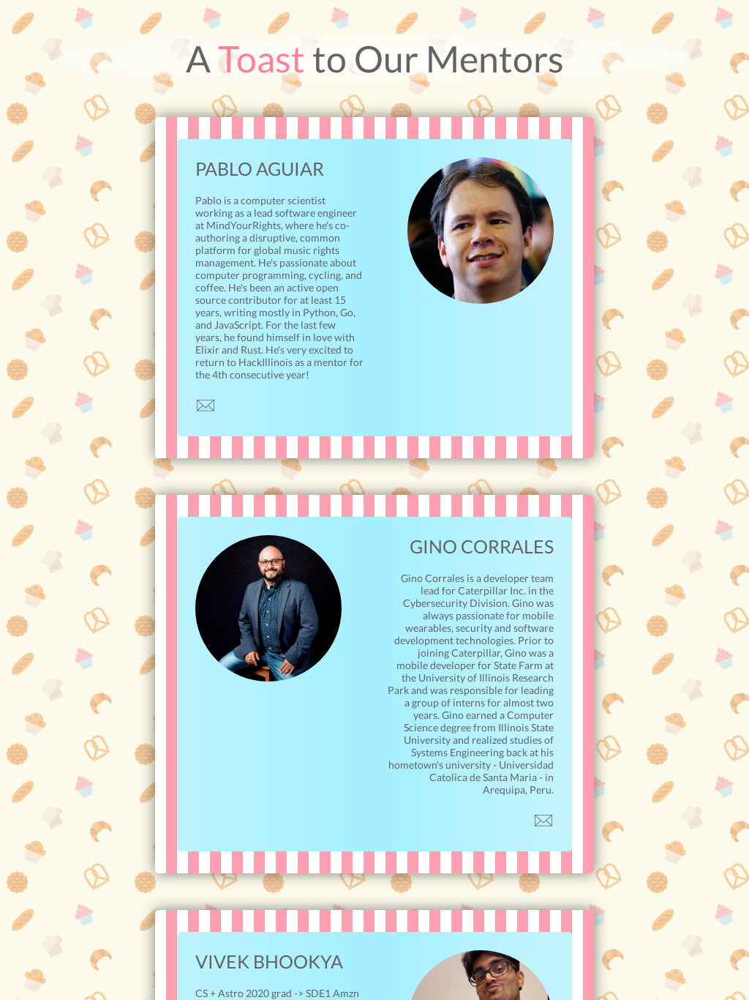
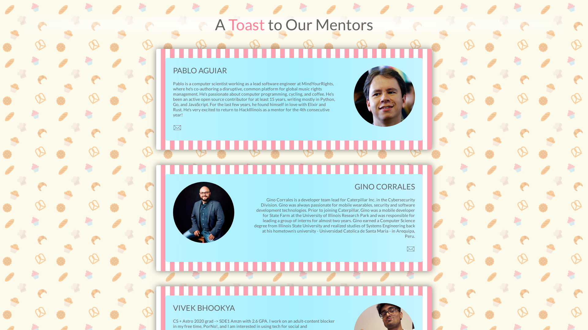

# HackIllinois Web Systems Coding Challenge

Built with React and Next.js.

This is the webpage I created for my application for the HackIllinois Systems Team.


## Running in Development Mode

- Clone the repository

```bash
git clone https://github.com/aniketgargya/hackillinois-systems-coding-challenge-web
```

- Install the npm packages
```bash
npm i
```

- Start the development server
```bash
npm run dev
```

- The server will be running on port 3000 ([http://localhost:3000](http://localhost:3000))

## Running in Production Mode

- Follow all the same steps as for development mode, up until starting the development server

- Build the static files and ouput them in the `out/` directory
```bash
npm run build
```

- Serve the files with the npm `serve` package or simply open the pages from the `out/` directory
```bash
npm start
```

## Screenshots


375x812 Screenshot



1024x1633 Screenshot



1920x1080 Screenshot
